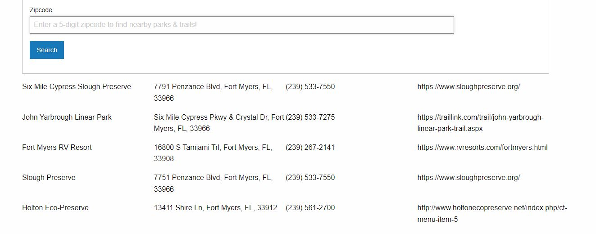

# Easy Trail Finder

Easy Trail Finder is an application that will allow you to search a zipcode to find nearby parks and trails.

## Live Deployed Link:
https://shaunmichaelgreene.github.io/easy-trail-finder/

## Usage

We use HTML, CSS, Foundation, JavaScript and a few API's to create an application to find nearby parks or trails. After a zipcode is entered into the search bar and the search button is clicked, we pull data from 2 different API's that will display the 5 closest parks or trails with info on each one found as shown below. 

## Contributors
Shaune Greene, Dylan Okum, Danielle Vespa

Special Thanks To:  Kevin Begin, Cabral Williams, Brennan Spicer, Oziel Gómez, Placeholder for API 1, Placeholder for API 2
